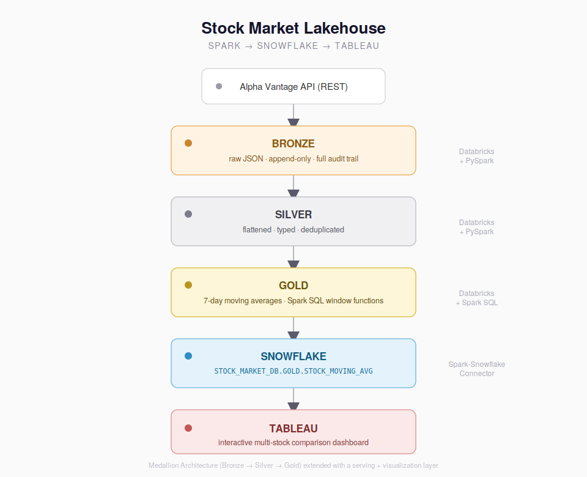
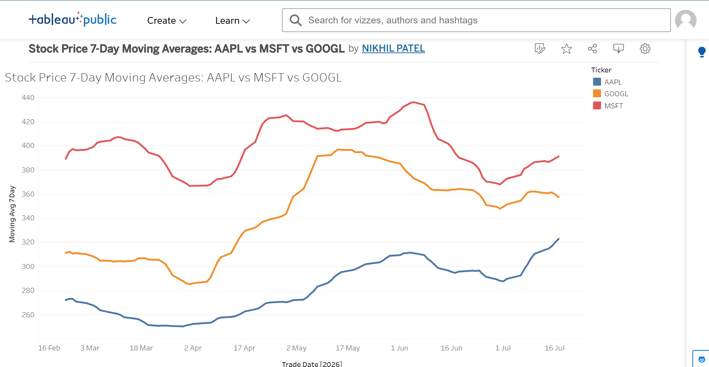
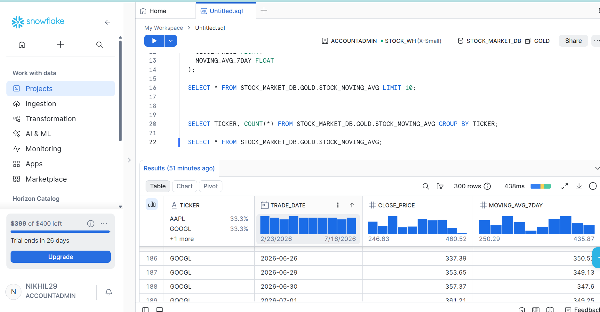

# Stock Market Lakehouse — Spark + Snowflake + Tableau

An end-to-end data pipeline that pulls daily stock prices for AAPL, MSFT, and GOOGL, transforms them through a Bronze → Silver → Gold (Medallion) architecture on Databricks, serves the finished output through Snowflake, and visualizes 7-day moving average trends in Tableau.

This project mirrors a real, common industry pattern: **Spark handles heavy transformation, Snowflake serves the finished data, Tableau visualizes it** — the same separation of concerns used at companies running production analytics stacks.

🔗 **Live dashboard:** [Stock Price 7-Day Moving Averages: AAPL vs MSFT vs GOOGL](https://public.tableau.com/app/profile/nikhil.patel2369/viz/StockPrice7-DayMovingAveragesAAPLvsMSFTvsGOOGL/Sheet1)

---

## Architecture



```
Alpha Vantage API (REST)
        |
        v
  BRONZE   ->  raw JSON landed as-is, append-only, full audit trail
        |      (Databricks + Delta Lake)
        v
  SILVER   ->  flattened, typed, deduplicated (one row per ticker per day)
        |      (Databricks + Delta Lake)
        v
  GOLD     ->  7-day moving averages via Spark SQL window functions
        |      (Databricks + Delta Lake)
        v
  SNOWFLAKE ->  finished Gold output written via Spark-Snowflake connector
        |       (STOCK_MARKET_DB.GOLD.STOCK_MOVING_AVG)
        v
  TABLEAU  ->  interactive multi-stock moving-average comparison
```

## Tech stack

Databricks (Serverless), PySpark, Spark SQL, Delta Lake, Snowflake, Spark-Snowflake Connector, Tableau Public, Python `requests`, Alpha Vantage free-tier API

## What it does

- Pulls daily OHLCV data for 3 tickers from the Alpha Vantage REST API, respecting the free-tier rate limit (~1 request per 15 seconds)
- Lands raw JSON in an append-only Bronze layer for a full audit trail
- Flattens and types the data into a deduplicated Silver layer
- Computes 7-day rolling moving averages per ticker using Spark SQL window functions (`PARTITION BY ticker ORDER BY trade_date ROWS BETWEEN 6 PRECEDING AND CURRENT ROW`)
- Writes the finished Gold table into Snowflake using the Spark-Snowflake connector
- Visualizes the result as an interactive multi-stock line chart in Tableau

## Key engineering challenges solved

This section covers the real issues hit while building this — not hypotheticals.

**1. Databricks Serverless blocks the standard `sfURL` connection option**

The Spark-Snowflake connector's documented approach — passing a full `sfURL` — fails on Databricks Serverless compute with:
```
IllegalArgumentException: Serverless does not support the following write options: sfurl.
```
Serverless restricts which connector options are allowed for security reasons. Fixed by switching to the `host` + `port` parameter pair instead of `sfURL`, both of which are on Serverless's approved list.

**2. A multi-layer data-completeness bug traced back through 4 pipeline stages**

After confirming a successful Spark → Snowflake write, a verification query revealed the Snowflake table held only AAPL data — MSFT and GOOGL were missing, despite the notebook containing correct multi-ticker fetch logic.

Root-caused by tracing backward one layer at a time:
- Snowflake → only AAPL
- Gold table → only AAPL
- Silver table → only AAPL
- Bronze table → only AAPL
- **Root cause found:** an early single-ticker prototype cell (hardcoded `ticker="AAPL"`) sat earlier in the notebook than a later, correctly-written multi-ticker loop. Because notebook cells execute in whatever order they're run — not their position in the file — re-running cells out of order caused the old single-ticker code to silently overwrite the correct multi-ticker variable each time.

Fixed by identifying the correct, later cells for Bronze and Silver construction and re-running the full pipeline in the right execution order, verifying row counts at each layer before moving to the next.

**3. API rate limiting on the free tier**

Alpha Vantage's free tier allows roughly 1 request per second and a low daily cap. Looping over 3 tickers back-to-back caused failures. Fixed with `time.sleep(15)` between requests and a defensive check (`if "Time Series (Daily)" in result`) to catch responses that return HTTP 200 but contain an error message instead of real data.

**4. Secure credential handling across two platforms**

Both the Alpha Vantage API key and Snowflake username/password are entered via Databricks widgets (`dbutils.widgets`) at runtime rather than hardcoded — extending the same secure-credential pattern from the original ETL project to the new Snowflake integration.

## Results

7-day moving averages computed and compared across all three tickers, February–July 2026:

| Ticker | Approx. range (7-day MA) |
|--------|---------------------------|
| MSFT   | ~$350 – $450 |
| GOOGL  | ~$290 – $410 |
| AAPL   | ~$250 – $330 |



**Verification — all 300 rows (3 tickers × 100 trading days) landed correctly in Snowflake:**



## Repo structure

```
├── README.md
├── Stock_Pipeline_Project.ipynb   # Full Databricks notebook: Bronze → Silver → Gold → Snowflake
├── snowflake_setup.sql            # Database, schema, warehouse, and table creation
├── architecture-diagram.png
├── tableau-dashboard.png
└── snowflake-verification.png
```

## Setup / reproduction

1. Get a free [Alpha Vantage API key](https://www.alphavantage.co/support/#api-key)
2. Create a free [Snowflake trial account](https://signup.snowflake.com)
3. Run `snowflake_setup.sql` in a Snowflake worksheet to create the database, schema, warehouse, and target table
4. Import `Stock_Pipeline_Project.ipynb` into Databricks
5. Enter your Alpha Vantage API key and Snowflake credentials into the notebook widgets at runtime
6. Run all cells top to bottom
7. Connect Tableau Public to a CSV export of the final Snowflake table (Tableau Public does not support live Snowflake connections — that requires Tableau Desktop/Server)

---

*Built as a follow-on to an original single-tool Stock Market ETL pipeline, extending it with a multi-tool architecture (Spark → Snowflake → Tableau) as a step toward production-style data engineering patterns.*

